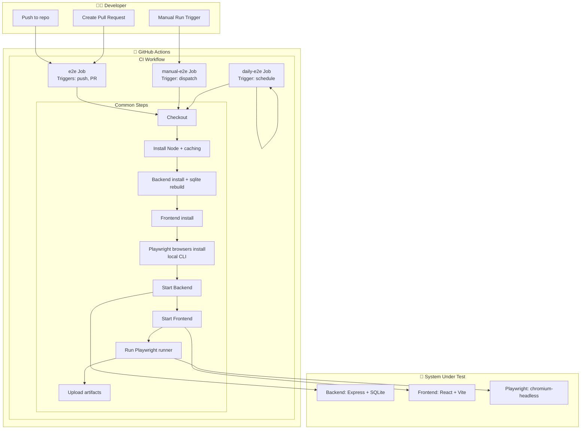
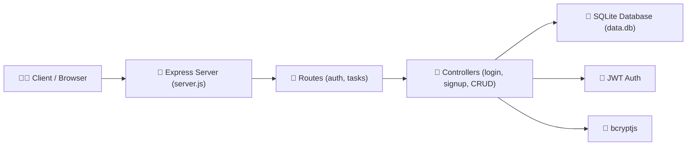
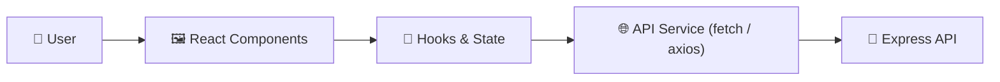
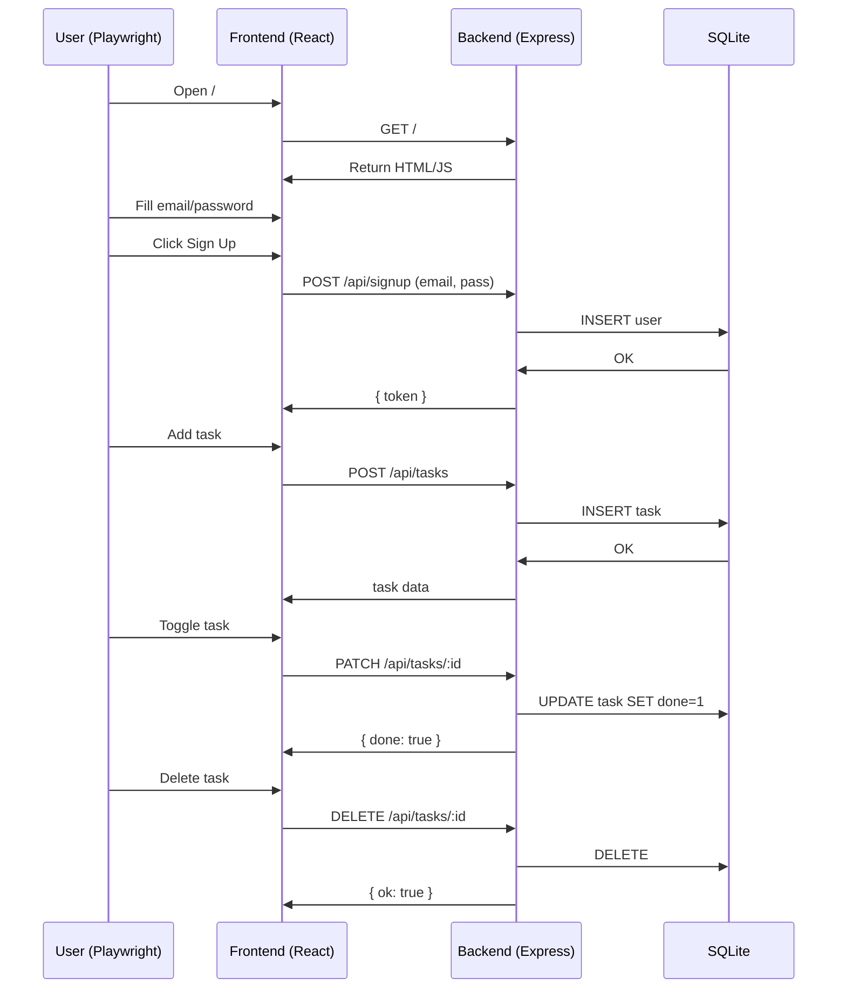

# 📘 Task Tracker — Full Documentation Pack

Полный комплект документации проекта: диаграммы, архитектура, sequence diagrams, overview pipelines.

---

# 🧩 1. Mermaid Diagram — Инфраструктура CI/CD



---

# 🧱 2. Архитектура Backend (Mermaid Component Diagram)



---

# 🎨 3. Архитектура Frontend (Vite + React)



---

# 🔄 4. Sequence Diagram — “Signup → Add Task → Toggle → Delete”



---

# 🏛 5. Архитектурная Диаграмма Проекта (Full System Overview)

```mermaid
graph TD

    subgraph Frontend["React + Vite"]
        R1[Login Page]
        R2[Tasks Page]
        R3[UI State / Hooks]
    end

    subgraph Backend["Node.js + Express"]
        E1[server.js]
        E2[auth routes]
        E3[tasks routes]
        E4[controllers]
        E5[JWT middleware]
    end

    subgraph Database["SQLite"]
        D1[users table]
        D2[tasks table]
    end

    subgraph Tests["Playwright"]
        T1[auth-and-crud.spec.cjs]
        T2[chromium-headless]
    end

    subgraph CI["GitHub Actions"]
        C1[e2e (push/PR)]
        C2[daily-e2e (cron)]
        C3[manual-e2e (dispatch)]
    end

    R1 --> E2
    R2 --> E3
    E4 --> D1
    E4 --> D2
    T1 --> R1
    T1 --> R2
    C1 --> T1
    C2 --> T1
    C3 --> T1
```

---

# 📝 6. Postmortem (Google SRE Style)

## 📌 Incident Summary

CI pipeline был полностью нестабилен в течение ~7 дней:

- тесты не запускались
- pipeline ломался на разных стадиях
- глобальные бинарники нарушали работу Playwright
- SQLite ломался в Linux
- ручные джобы запускали лишние e2e джобы

## 📌 Root Causes

1. Неверная рабочая директория в GitHub Actions
2. Глобальный playwright-cli перехватывал вызовы
3. testMatch настроен некорректно
4. sqlite3 был установлен под Windows, а не Linux
5. browsers устанавливались через глобальный Playwright
6. неверные условия в workflow jobs
7. недостаточный health-check backend

## 📌 What Went Well

✅ Все проблемы были устранены  
✅ CI теперь стабильный  
✅ Тесты выполняются одинаково локально и в CI  
✅ Backend/Frontend запускаются корректно  
✅ pipeline стал профессиональным и надёжным

## 📌 What Went Wrong

❌ GitHub Actions скрывает глобальный playwright  
❌ tricky поведение with ESM/CJS  
❌ testMatch по умолчанию рискованный  
❌ sqlite3 — самый проблемный модуль cross-platform

## 📌 Action Items

✅ Использовать локальный Playwright runner  
✅ Устанавливать браузеры через playwright-core  
✅ Добавить условия if:  
✅ testMatch="\*_/_.spec.cjs"  
✅ Улучшенный health-check  
✅ Пересборка sqlite3 под Linux

Long-term:
⬜ Возможный переход на Prisma  
⬜ Unit tests для backend  
⬜ Docker контейнеризация

---

# ✅ Конец документа
